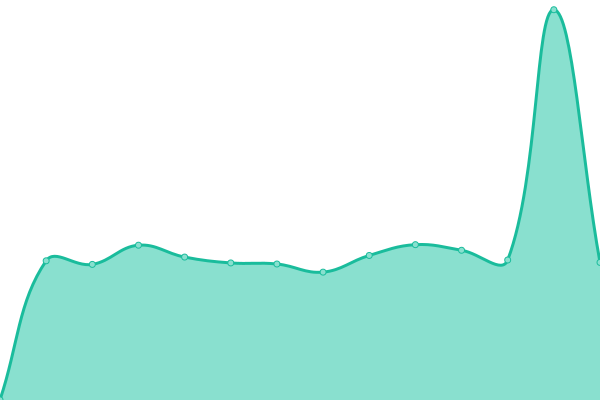
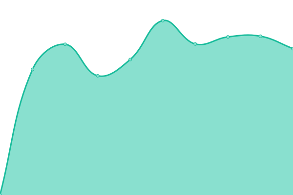

# [📈 Live Status](https://govindbhardwaj.github.io/monitor-ritam): <!--live status--> **🟥 Complete outage**

This repository contains the open-source uptime monitor and status page for [Govind Bhardwaj](https://govindbhardwaj.github.io), powered by [Upptime](https://github.com/upptime/upptime).

With [Upptime](https://upptime.js.org), you can get your own unlimited and free uptime monitor and status page, powered entirely by a GitHub repository. We use [Issues](https://github.com/govindbhardwaj/monitor-ritam/issues) as incident reports, [Actions](https://github.com/govindbhardwaj/monitor-ritam/actions) as uptime monitors, and [Pages](https://govindbhardwaj.github.io/monitor-ritam) for the status page.

<!--start: status pages-->
<!-- This summary is generated by Upptime (https://github.com/upptime/upptime) -->
<!-- Do not edit this manually, your changes will be overwritten -->
<!-- prettier-ignore -->
| URL | Status | History | Response Time | Uptime |
| --- | ------ | ------- | ------------- | ------ |
|  [Mobile Application APIs](https://ritamdigital.org/services/ritam/api/posts/top-headlines/tag/top-stories/editor) | 🟥 Down | [mobile-application-ap-is.yml](https://github.com/govindbhardwaj/monitor-ritam/commits/HEAD/history/mobile-application-ap-is.yml) | 

 1248ms
     
 | 

<a href="https://govindbhardwaj.github.io/monitor-ritam/history/mobile-application-ap-is">99.81%</a>
    

|  [Editor CMS](https://editor.ritamdigital.org/services/ritam/api/posts/top-headlines/tag/top-stories/editor) | 🟥 Down | [editor-cms.yml](https://github.com/govindbhardwaj/monitor-ritam/commits/HEAD/history/editor-cms.yml) | 

 1047ms
     
 | 

<a href="https://govindbhardwaj.github.io/monitor-ritam/history/editor-cms">99.69%</a>
    

|  [Crawler APIs](https://crawler.ritamdigital.org/services/ritam/api/posts/top-headlines/tag/top-stories/editor) | 🟥 Down | [crawler-ap-is.yml](https://github.com/govindbhardwaj/monitor-ritam/commits/HEAD/history/crawler-ap-is.yml) | 

 1092ms
     
 | 

<a href="https://govindbhardwaj.github.io/monitor-ritam/history/crawler-ap-is">100.00%</a>
    

|  [Jenkins Server](https://jenkins.ritamdigital.org) | 🟥 Down | [jenkins-server.yml](https://github.com/govindbhardwaj/monitor-ritam/commits/HEAD/history/jenkins-server.yml) | 

 1057ms
     
 | 

<a href="https://govindbhardwaj.github.io/monitor-ritam/history/jenkins-server">0.00%</a>
    

<!--end: status pages-->

[**Visit our status website →**](https://govindbhardwaj.github.io/monitor-ritam)

## 📄 License

- Powered by: [Upptime](https://github.com/upptime/upptime)
- Code: [MIT](./LICENSE) © [Anand Chowdhary](https://anandchowdhary.com), supported by [Pabio](https://pabio.com)
- Data in the `./history` directory: [Open Database License](https://opendatacommons.org/licenses/odbl/1-0/)
